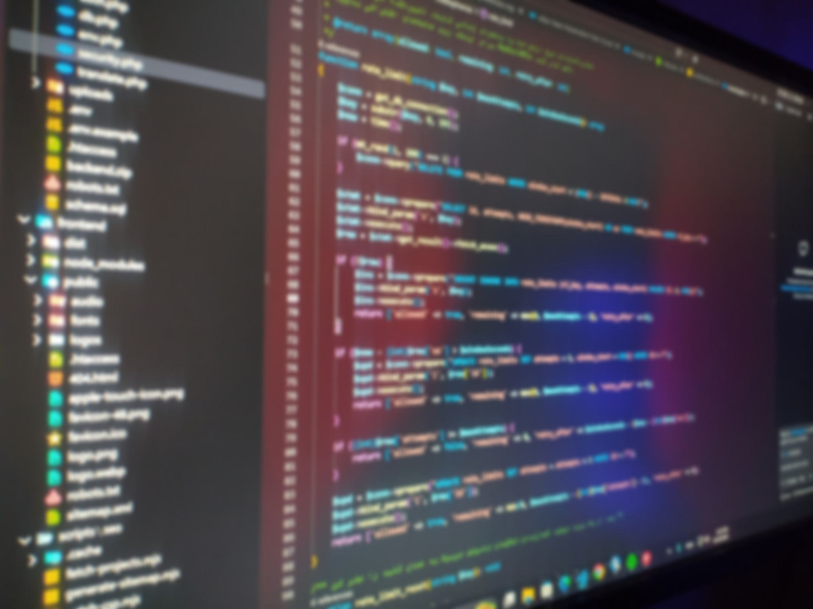

 

<h2>Amirali Yavari</h2>

I'm Amirali Yavari, a full-stack developer. I've been programming for two years, constantly exploring new approaches to coding, interface design, and security, and putting what I learn into practice.

Professionally, I work with PHP and Express.js on the backend, and React.js and Next.js on the frontend. I also work with JavaScript, TypeScript, Node.js, MySQL, and Lua, mainly for game scripting.

My favourite games are Counter-Strike 2 and Rainbow Six Siege. :)

<b>Languages & Technologies:</b> 
PHP · TypeScript · JavaScript · React.js · Next.js · Express.js · Node.js · Lua · MySQL

